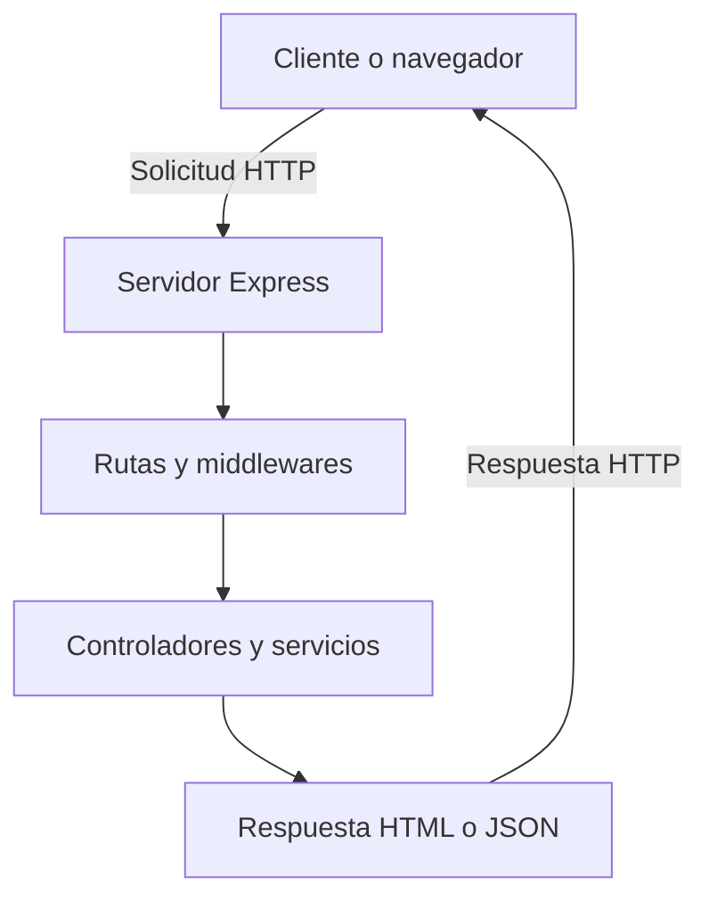

# CreativeFlow Backend

Aplicación web desarrollada con Node.js y Express para la gestión de proyectos creativos. Esta primera versión corresponde al Módulo 6 del curso Desarrollo de Aplicaciones Full Stack JavaScript Trainee.

El proyecto permite servir contenido HTML, entregar archivos estáticos, consultar el estado del servidor en formato JSON y registrar accesos en un archivo de texto.

## Objetivos

- Configurar un servidor utilizando Node.js y Express.
- Implementar rutas públicas con respuestas HTML y JSON.
- Servir archivos estáticos desde la carpeta `public`.
- Registrar accesos mediante `fs.appendFile()`.
- Aplicar una arquitectura modular.
- Manejar rutas inexistentes y errores.
- Preparar el proyecto para incorporar una base de datos y autenticación.

## Tecnologías utilizadas

- Node.js
- Express
- npm
- dotenv
- nodemon
- HTML5
- CSS3
- Git y GitHub

## Node.js y Express

### ¿Qué es Node.js?

Node.js es un entorno de ejecución que permite utilizar JavaScript fuera del navegador. Se utiliza para crear servidores, aplicaciones web, herramientas de línea de comandos y servicios backend.

Su arquitectura orientada a eventos permite procesar solicitudes de forma eficiente. Además, incorpora npm, el gestor de paquetes utilizado para instalar las dependencias del proyecto.

### ¿Qué aporta Express?

Express es un framework que simplifica el desarrollo de aplicaciones web con Node.js. Proporciona herramientas para:

- Crear rutas.
- Procesar solicitudes y respuestas HTTP.
- Implementar middlewares.
- Servir archivos estáticos.
- Organizar la aplicación de forma modular.
- Centralizar el manejo de errores.

Node.js proporciona el entorno de ejecución, mientras que Express facilita la construcción y organización del servidor web.

## Flujo cliente-servidor



1. El cliente realiza una solicitud HTTP.
2. Express recibe la solicitud.
3. El router identifica la ruta correspondiente.
4. Los middlewares ejecutan tareas intermedias.
5. El controlador genera la respuesta.
6. El servidor devuelve contenido HTML o JSON.

## Estructura del proyecto

```text
creativeflow-backend/
├── controllers/
│   └── homeController.js
├── logs/
│   └── log.txt
├── middlewares/
│   ├── errorHandler.js
│   ├── notFound.js
│   └── visitLogger.js
├── public/
│   ├── css/
│   │   └── styles.css
│   └── index.html
├── routes/
│   └── indexRoutes.js
├── services/
│   └── logService.js
├── .env.example
├── .gitignore
├── index.js
├── package-lock.json
├── package.json
└── README.md
```

## Requisitos del sistema

Antes de ejecutar el proyecto se necesita:

- Node.js versión 18 o superior.
- npm.
- Una terminal o consola de comandos.
- Un navegador web.

## Instalación

1. Abre una terminal dentro de la carpeta del proyecto.

2. Instala las dependencias:

```bash
npm install
```

3. Crea el archivo `.env` a partir de `.env.example`.

En Windows:

```cmd
copy .env.example .env
```

En macOS o Linux:

```bash
cp .env.example .env
```

4. Comprueba que `.env` contenga:

```env
PORT=3000
```

## Ejecución

### Modo normal

```bash
npm start
```

Este comando ejecuta:

```bash
node index.js
```

### Modo de desarrollo

```bash
npm run dev
```

Este comando utiliza nodemon para reiniciar automáticamente el servidor cada vez que se modifica un archivo JavaScript.

Después de iniciar el servidor, abre:

```text
http://localhost:3000
```

## Rutas disponibles

| Método | Ruta | Respuesta | Descripción |
|---|---|---|---|
| GET | `/` | HTML | Muestra la página principal de CreativeFlow. |
| GET | `/status` | JSON | Informa el estado actual del servidor. |
| Cualquiera | Ruta inexistente | JSON | Devuelve un error 404 estructurado. |

### Ejemplo de `/status`

```json
{
  "status": "success",
  "message": "Servidor funcionando correctamente",
  "data": {
    "application": "CreativeFlow",
    "port": "3000"
  }
}
```

### Ejemplo de ruta inexistente

```json
{
  "status": "error",
  "message": "Ruta no encontrada: /no-existe",
  "data": null
}
```

## Archivos estáticos

Express sirve los archivos ubicados en `public`.

La hoja de estilos puede comprobarse directamente en:

```text
http://localhost:3000/css/styles.css
```

La opción `index: false` permite que la ruta `/` sea procesada por el controlador antes de enviar `public/index.html`.

## Registro de accesos

Cada visita a `/status` queda registrada en:

```text
logs/log.txt
```

La aplicación utiliza `fs.appendFile()` para agregar información sin eliminar los registros anteriores.

Ejemplo:

```text
Fecha: 09-08-2026 | Hora: 23:04:06 | Ruta: /status
```

Cada registro contiene:

- Fecha.
- Hora.
- Ruta solicitada.

## Decisiones técnicas

### Elección de `index.js`

Se utilizó `index.js` porque es una convención habitual para identificar el punto de entrada principal de una aplicación Node.js. También coincide con el campo `main` definido en `package.json`.

### Scripts de ejecución

Se creó `npm start` para ejecutar la aplicación de manera normal y `npm run dev` para facilitar el desarrollo mediante nodemon.

Esta separación permite utilizar un comando estable para la ejecución y otro orientado a realizar modificaciones.

### Arquitectura modular

El proyecto se dividió en rutas, controladores, middlewares y servicios para separar responsabilidades y facilitar su mantenimiento.

- `routes` define las direcciones disponibles.
- `controllers` genera las respuestas.
- `middlewares` procesa solicitudes y errores.
- `services` contiene la lógica de registro en archivos.
- `public` almacena el contenido estático.
- `logs` conserva los accesos registrados.

### Uso de archivos estáticos

Se utilizó la carpeta `public` porque la aplicación necesita entregar una interfaz HTML y una hoja de estilos. No se incorporó un motor de plantillas porque esta primera versión no requiere generar vistas dinámicas desde el servidor.

### Variables de entorno

El puerto se configura mediante dotenv para evitar dejar configuraciones modificables escritas directamente en el código.

El archivo `.env` no se incluye en Git porque puede contener información privada. En su lugar, `.env.example` documenta las variables necesarias.

## Reflexión técnica

La principal conclusión de esta etapa fue comprender que una aplicación backend no consiste solamente en iniciar un servidor. También requiere separar responsabilidades, controlar el flujo de las solicitudes, manejar errores y documentar correctamente su funcionamiento.

La estructura modular permitirá incorporar nuevas funcionalidades sin concentrar todo el código en `index.js`. Esto facilitará la integración de PostgreSQL, Sequelize, operaciones CRUD, autenticación mediante JWT y subida de archivos durante los módulos siguientes.

## Próximas etapas

- Conectar PostgreSQL.
- Implementar Sequelize como ORM.
- Crear modelos y relaciones.
- Desarrollar operaciones CRUD.
- Implementar registro y autenticación de usuarios.
- Proteger rutas mediante JWT.
- Incorporar subida y validación de archivos.
- Exponer una API RESTful.

## Autora

Johanna Romero

Proyecto académico desarrollado para el curso Desarrollo de Aplicaciones Full Stack JavaScript Trainee.

## Licencia

ISC